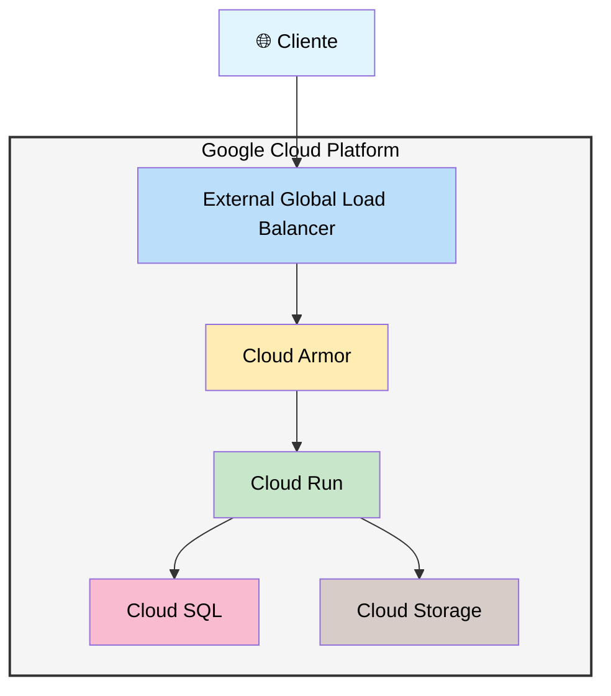

# Atlas - Sistema de Gestión de Documentos Empresariales

## 📌 Descripción del Proyecto

Atlas es una plataforma empresarial de gestión de documentos que proporciona una interfaz web
para que usuarios de diferentes entidades puedan subir archivos que posteriormente serán
procesados por equipos internos.

### Características Principales

- **Explorador de Archivos Jerárquico**: Estructura de carpetas con navegación intuitiva
- **Formularios Dinámicos**: Mecanismo para crear formularios personalizados por carpeta
- **Gestión de Permisos**: Control de acceso granular basado en roles y entidades
- **Subida Segura**: Validación de tipos de archivo, tamaños y metadatos
- **Procesamiento Interno**: Integración con sistemas de procesamiento interno

## 🏗 Arquitectura del Sistema

### Estructura del Proyecto

```text
📁 atlas-api/
├── 📁 prisma/               # Configuración y esquemas de base de datos
├── 📁 src/
│   ├── 📁 api/              # Configuración base de APIs
│   ├── 📁 constants/        # Constantes y configuraciones globales
│   ├── 📁 errors/           # Sistema de manejo de errores personalizados
│   ├── 📁 extensions/       # Extensiones y utilidades globales
│   ├── 📁 generated/        # Código generado automáticamente
│   │   ├── 📁 prisma/       # Cliente y tipos de Prisma
│   │   └── 📁 zod/          # Esquemas de validación generados
│   ├── 📁 locales/          # Internacionalización y localización
│   ├── 📁 middlewares/      # Middlewares de Express personalizados
│   ├── 📁 modules/          # Módulos de la aplicación
│   │   ├── 📁 atlas/        # Módulo principal de gestión documental
│   │   │   ├── 📁 controllers/    # Controladores de endpoints
│   │   │   ├── 📁 repositories/   # Acceso a datos y consultas
│   │   │   ├── 📁 routes/         # Definición de rutas API
│   │   │   ├── 📁 services/       # Lógica de negocio principal
│   │   │   └── 📁 validations/    # Esquemas de validación Zod
│   │   ├── 📁 auth/         # Módulo de autenticación y autorización
│   │   └── 📁 health/       # Endpoints de monitoreo y salud
│   ├── 📁 services/         # Servicios de infraestructura compartidos
│   ├── 📁 store/           # Almacenamiento y estado global
│   ├── 📁 templates/       # Plantillas para emails y notificaciones
│   ├── 📁 types/           # Definiciones de tipos TypeScript
│   ├── 📁 utils/           # Utilidades y helpers compartidos
│   ├── app.ts             # Configuración principal de Express
│   └── index.ts           # Punto de entrada de la aplicación
├── 📁 .husky/             # Hooks de Git para calidad de código
├── commitlint.config.ts   # Configuración de validación de commits
├── docker-compose.yaml    # Configuración de Docker para desarrollo
├── eslint.config.js       # Configuración de ESLint
├── infra.config.example.json # Configuración de infraestructura
├── lint-staged.config.js  # Configuración de pre-commit hooks
├── package.json           # Dependencias y scripts del proyecto
├── prisma/index.ts        # Configuración y cliente de Prisma
├── release.config.js      # Configuración de releases automáticos
├── tsconfig.json         # Configuración de TypeScript
└── tsconfig.prod.json    # Configuración de TypeScript para producción
```

### Módulo Atlas - Núcleo del Sistema

El módulo principal implementa el sistema completo de gestión documental:

- **Explorador Jerárquico**: Navegación estructurada con permisos granulares
- **Gestión Multi-Entidad**: Soporte completo para múltiples organizaciones con aislamiento estricto
- **Formularios Dinámicos**: Sistema flexible donde cada carpeta final tiene su formulario personalizado
- **Subida Inteligente**: Proceso seguro con validaciones, generación automática de nombres y procesamiento
- **Control de Acceso**: Sistema de permisos basado en roles y entidades

## 🚀 Funcionalidades Clave

### 1. Explorador de Archivos

- Navegación jerárquica de carpetas
- Listado de contenido con permisos
- Creación y gestión de directorios
- Operaciones bulk (renombrado masivo)

### 2. Sistema de Formularios Dinámicos

Cada carpeta final puede tener asociado un formulario personalizado con:

- **Campos configurables**: Texto, números, fechas, selectores
- **Validaciones personalizadas**: Reglas específicas por campo
- **Metadatos**: Información adicional para procesamiento
- **Generación de nombres**: Nombres de archivo basados en respuestas del formulario

### 3. Generación Inteligente de Nombres

El sistema utiliza plantillas dinámicas para generar nombres de archivo:

```typescript
// Ejemplo de generación de nombres basado en metadatos y respuestas
const filename = await FileNameGeneratorService.buildFilename({
  parentId: folderId,
  formAnswer: formResponses
}, metadata);
```

**Funciones disponibles:**

- `metadata`: Valores de metadatos de la carpeta
- `controls`: Respuestas del formulario con formato específico
- `answer`: Respuestas del formulario con mapeo de valores
- `template`: Plantillas predefinidas (fechas, días, etc.)
- `path`: Rutas basadas en la estructura jerárquica

### 4. Gestión de Permisos

Sistema de control de acceso con:

- Permisos granulares (lectura, escritura, eliminación)
- Validación por usuario y entidad
- Soporte para super administradores

## 🛠 Stack Tecnológico

### Backend

- **Node.js 22+** con TypeScript
- **Express.js** framework web
- **Prisma** ORM para PostgreSQL
- **Zod** para validación de esquemas

### Infraestructura GCP

La plataforma Atlas está desplegada en Google Cloud Platform con la siguiente arquitectura:

- **Google Cloud Storage**: Almacenamiento seguro y escalable para archivos con alta disponibilidad y redundancia
- **Cloud SQL**: Base de datos PostgreSQL completamente administrada con replicación y backups automáticos
- **Cloud Run**: Contenedores serverless para la API con auto-scaling y gestión automática de recursos
- **Cloud Build**: Pipeline de CI/CD completo para despliegues automatizados con integración GitOps
- **External Global Load Balancer**: Balanceador de carga global HTTP(S) para alta disponibilidad y distribución geográfica
- **Cloud Armor**: Seguridad de capa de aplicación con políticas de IP para validación de origines de peticiones

#### Diagrama de Arquitectura



**Flujo de Peticiones:**

1. Las peticiones entran por el External Global Load Balancer
2. Cloud Armor valida los origines por políticas de IP configuradas
3. El balanceador distribuye la carga entre instancias de Cloud Run
4. Cloud Run ejecuta la API de Atlas en contenedores serverless
5. La API accede a Cloud SQL para operaciones de base de datos
6. Los archivos se almacenan y recuperan de Cloud Storage

### Seguridad

- **JWT** con tokens de refresco
- **Helmet** para headers de seguridad
- Validación estricta de entrada con Zod
- Sanitización de nombres de archivo
- **Cloud Armor**: Validación de origines por IP y políticas de seguridad

## 📋 API Endpoints Principales

### Explorador

```http
GET    /api/explorer                  # Listar contenido del directorio
POST   /api/explorer/files/upload     # Subir archivo con formulario
POST   /api/explorer/directories      # Crear directorio
PUT    /api/explorer/directories/:id  # Actualizar directorio
POST   /api/explorer/bulk/rename      # Renombrado masivo
DELETE /api/explorer/:id              # Eliminar archivo/directorio
```

### Gestión de Archivos

```http
GET    /api/files              # Listar archivos
GET    /api/files/:id          # Obtener metadatos de archivo
POST   /api/files              # Crear registro de archivo
PUT    /api/files/:id          # Actualizar metadatos
DELETE /api/files/:id          # Eliminar archivo
```

## 🚀 Instalación y Configuración

### Requisitos Previos

- Node.js 22+
- PostgreSQL 15+
- AWS S3 o GCP Cloud Storage configurado
- pnpm 10+

### Configuración

1. **Instalar dependencias:**

   ```bash
   pnpm install
   ```

2. **Configurar variables de entorno:**

   ```bash
   cp .env.example .env
   # Configurar DATABASE_URL, S3/GCS credentials, JWT secrets
   ```

3. **Ejecutar migraciones de base de datos:**

   ```bash
   pnpm prisma migrate dev
   ```

4. **Ejecutar en desarrollo:**

   ```bash
   pnpm run dev
   ```

## 🔧 Comandos Útiles

```bash
# Desarrollo
pnpm run dev              # Modo desarrollo con hot reload
pnpm run build            # Compilar TypeScript
pnpm run start            # Ejecutar en producción

# Base de datos
pnpm prisma migrate dev   # Ejecutar migraciones
pnpm prisma generate      # Generar cliente Prisma
pnpm prisma studio        # Abrir interfaz de base de datos

# Calidad de código
pnpm run lint             # Ejecutar ESLint
pnpm run lint:fix         # Corregir problemas de linting
pnpm run check-types      # Verificar tipos TypeScript
```

## 🎯 Flujo de Subida de Archivos

1. **Navegación**: Usuario navega por el explorador jerárquico
2. **Selección**: Usuario selecciona carpeta destino con formulario asociado
3. **Formulario**: Se muestra formulario dinámico configurado para la carpeta
4. **Validación**: Se validan las respuestas del formulario
5. **Subida**: Archivo se sube con metadatos y nombre generado automáticamente
6. **Procesamiento**: Archivo queda disponible para procesamiento interno

## 🔒 Seguridad

- Validación de tipos MIME y extensiones permitidas
- Límites de tamaño de archivo configurables por carpeta
- Sanitización de nombres de archivo para prevenir path traversal
- Validación de permisos en cada operación
- Logging de todas las operaciones sensibles

## 📊 Monitoreo y Logging

- Logging estructurado con Winston
- Métricas de rendimiento y uso
- Auditoría de operaciones de archivos
- Monitoreo de salud del sistema

## 🤝 Contribución

El proyecto sigue convenciones establecidas:

- **Estructura de módulos**: Separación clara por responsabilidades
- **Tipado estricto**: TypeScript con configuraciones estrictas
- **Validaciones**: Zod para todas las entradas de API
- **Patrones**: Repository pattern, service layer, dependency injection
